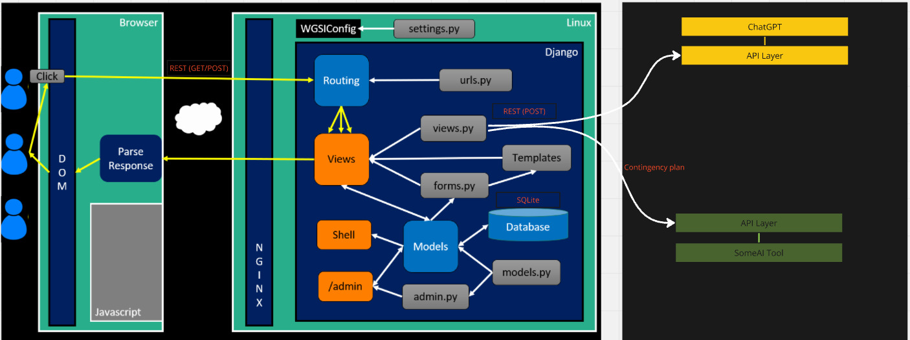
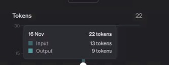
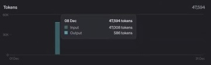

# EyeBankWebsite – A Platform for Retrieving AI-Analyzed Medical Records

## Project Overview

EyeBankWebsite is a web-based application developed using Django that enables users to upload donor medical records and retrieve AI-analyzed data for assessment. Leveraging the power of ChatGPT, the platform helps medical professionals streamline the donor evaluation process by extracting and interpreting critical medical information.

## Key Features

### 1. Donor Record Upload
- Currently supports only .pdf files, with plans for future support of additional file formats.
- Secure and efficient file handling to comply with medical data regulations (e.g., HIPAA).

### 2. AI-Based Medical Data Analysis
- Uploaded medical records are analyzed by ChatGPT.  
- Extracted information is structured and presented for easy review.  
- Focuses on key medical aspects such as:  
  - Electronic Medical Records (EMR)  
  - Sepsis Detection  
  - Blood Transfusion Compatibility
- PDF Handling: The platform processes uploaded .pdf files using a combination of Python libraries like pdfplumber to extract text and medical information for further analysis.

### 3. Prompt-Based Question Retrieval
- Users select predefined prompts stored in `promptX.txt` files.  
- The system retrieves and displays AI-analyzed medical responses based on selected prompts.  

### 4. User-Friendly Interface
- Built with HTML, CSS, and JavaScript for a seamless experience.  
- Simple navigation for quick access to analyzed data.  

## Technology Stack

- **Backend:** Django (Python)  
- **Frontend:** HTML, CSS, JavaScript  
- **Database:** SQLite(currently), PostgreSQL(preferred)
- **File Handling:** PDF processing for medical record extraction  

## Project Objective

EyeBankWebsite enhances the donor assessment process by enabling faster analysis of large volumes of medical data, helping medical professionals make informed decisions efficiently.

## Architecture

### Frontend (Browser)
- Users interact with the application via a web interface.
- Actions (clicks) trigger JavaScript, which sends REST (GET/POST) requests to the backend.
- The browser parses responses and updates the DOM accordingly.

### Backend (Django on Linux)
- **WSGIConfig** bridges the web server and Django.

#### Django Core Components:
- **Routing (urls.py)**: Handles incoming requests and maps them to views.
- **Views (views.py)**: Processes logic and interacts with models/forms.
- **Templates**: Renders dynamic HTML responses.
- **Forms (forms.py)**: Handles user input validation.
- **Models (models.py)**: Defines database schema.
- **Database (SQLite)**: Stores application data.
- **Admin Panel (admin.py)**: Provides a web-based interface for managing data.
- **Shell**: Command-line access for executing Django scripts.

### External AI Integration
- Django communicates with an **API Layer** that connects to ChatGPT.
- A **contingency plan** routes AI requests to an alternative SomeAI Tool if ChatGPT is unavailable.

## Architectural Pattern Classification

In Django, the architecture follows a Model-View-Controller (MVC) pattern, which is slightly adapted to the Model-Template-View (MTV) pattern. Here's how the components align with the MVC pattern:

### Model
- The **Model** represents the database structure and business logic.
- It defines the data schema (what data will be stored in the database) and provides methods for data manipulation.
- In Django, the **Model** is defined in `models.py`.

### View
- The **View** is responsible for processing the business logic and interacting with the model.
- In Django, the **View** handles incoming HTTP requests, interacts with models, and returns the appropriate response.
- Views are defined in `views.py`.

### Controller
- In the Django MVC pattern, the **Controller** is somewhat implicit, as the framework handles much of the routing logic.
- The controller is essentially the mechanism that takes the request and determines which view to call and which model to interact with.

### Template
- The **Template** is responsible for rendering the UI and presenting the data to the user.
- Django separates the UI logic (HTML, CSS, JavaScript) from the business logic, with templates stored in the **Templates** folder.

### Hybrid Architecture with AI Integration
The AI API layer adds flexibility, enabling EyeBankWebsite to incorporate cutting-edge medical analysis capabilities, such as detecting sepsis or assessing blood transfusion compatibility, making it scalable to future AI advancements.

## Token Consumption by ChatGPT

When interacting with ChatGPT, it’s important to understand how tokens are consumed during processing. Tokens are units of text that the model uses to understand and generate language. Both the input (what you send) and the output (what the model returns) consume tokens.

For larger documents, token limits can be managed by chunking data or summarizing large inputs before sending them to ChatGPT for analysis. This ensures efficient usage of tokens and prevents hitting API limits.

### Token Breakdown for Simple Text
For a simple text, like "Hello", the token consumption is minimal:

- **Input**: 13 tokens
- **Output**: 9 tokens

### Token Breakdown for Large Inputs (e.g., PDF Files)
When processing larger inputs, such as extracting text from PDF files, the token count can increase significantly:

- **Input**: 47,008 tokens (for a large PDF)
- **Output**: 586 tokens

This token consumption is influenced by factors such as the size of the input, the complexity of the content, and how much output is generated. For large files or complex data, token consumption can grow, which may impact costs and performance.

### Token Limits
Each API call to ChatGPT has a token limit, which is the maximum number of tokens that can be processed in a single request (input + output). It’s essential to keep this in mind when submitting large documents or requests for AI processing.

## File Structure

| File/Folder            | Description |
|------------------------|-------------|
| **EyeBankWebsite/**    | Root directory of the Django project. |
| ├── **.gitignore**     | Specifies files and folders to ignore in version control. |
| ├── **config.yaml**    | Configuration file for project settings. |
| ├── **db.sqlite3**     | SQLite database file (used for local development). |
| ├── **manage.py**      | Django management script for running commands. |
| ├── **README.md**      | Documentation file describing the project. |
| ├── **requirements.txt** | Lists required Python dependencies. |
| ├── **_project_description** | File containing a brief project overview. |
| ├── **donor_assessment/** | Django app for donor assessment functionality. |
| │   ├── **__init__.py** | Marks the directory as a Python package. |
| │   ├── **admin.py** | Admin panel configuration. |
| │   ├── **apps.py** | App configuration file. |
| │   ├── **forms.py** | Django forms for handling user input. |
| │   ├── **models.py** | Database models for donor assessment. |
| │   ├── **tests.py** | Unit tests for the donor assessment app. |
| │   ├── **urls.py** | URL routing configuration for the app. |
| │   ├── **views.py** | Contains view functions to handle requests. |
| │   ├── **migrations/** | Database migration files. |
| │   │   ├── **__init__.py** | Marks the directory as a Python package. |
| │   │   ├── **0001_initial.py** | Initial database schema migration. |
| │   ├── **prompts/** | Folder containing text prompts. |
| │   │   ├── **prompt1.txt** - **prompt4.txt** | Text files containing predefined prompts which send to AI with .pdf file |
| │   ├── **static/** | Folder for static assets like CSS and images. |
| │   │   ├── **css/** | Stylesheets for the website. |
| │   │   │   ├── **main.css** | Main CSS file for styling. |
| │   │   │   ├── **output.css** | Generated output from a CSS preprocessor (if used). |
| │   │   ├── **images/** | Stores image assets. |
| │   │   │   ├── **ebaa-accredited.webp** | Accreditation badge image. |
| │   │   │   ├── **lions_eye_bank_logo.png** | Logo of the Eye Bank. |
| │   ├── **templates/** | Contains HTML templates for the app. |
| │   │   ├── **home.html** | Main homepage template. |
| │   ├── **__pycache__/** | Compiled Python bytecode files for optimization. |
| ├── **EyeBankWebsite/** | Main Django project folder. |
| │   ├── **__init__.py** | Marks the directory as a Python package. |
| │   ├── **asgi.py** | Entry point for ASGI servers. |
| │   ├── **settings.py** | Main project configuration file. |
| │   ├── **urls.py** | URL routing configuration for the project. |
| │   ├── **wsgi.py** | Entry point for WSGI servers. |
| │   ├── **__pycache__/** | Compiled Python bytecode files. |
| ├── **staticfiles/** | Collects all static files when `collectstatic` is run. |
| │   ├── **css/** | Stores collected CSS files. |
| │   ├── **images/** | Stores collected images. |
| │   ├── **admin/** | Static files for Django's admin interface. |
| │   │   ├── **css/**, **fonts/**, **img/**, **js/**, **vendor/** | Various assets for Django's admin panel. |
| ├── **__pycache__/** | Cached Python files for faster execution. |

